# Rihla — Architecture Snapshot for Senior-Dev Review

> **Reviewer**: this document was reconstructed from the codebase on **2026-05-28**, not authored from a design doc. Treat every claim as falsifiable; the code at `HEAD` of branch `codex/auth-release-hardening-fix-pass` wins. References are `path:line`.

## TL;DR for the reviewer

- **What it is**: Rihla (package `safar`, Android `com.safar.safar`) — Splitwise-style group-expense tracker. Flutter (Riverpod 2 + GoRouter 13) on top of Firebase only (Firestore, Auth, Cloud Functions, FCM, Hosting, App Check). SQLite is **local read cache only**.
- **Stage**: Deployed but small. Closed test done; production application submitted to Play Store **2026-05-27** (no live prod users yet). Android-only launch; iOS deferred.
- **Single dev**, ~weeks-long hardening sprint just landed (account-recovery, account-deletion cascade, App Check, balance-calculator fixes).
- **The big shape decisions**:
  1. Anonymous auth by default with optional email-link recovery as the only durable identity.
  2. Money math is client-side (Dart `Decimal`), persisted as integer subunits at the Firestore boundary only.
  3. Firestore is the only source of truth; SQLite mirrors what the streams emit. No custom sync queue.
  4. All cross-tenant / cross-identity / multi-doc operations (group join, account deletion, recovery rewrite) go through Cloud Functions callables with `enforceAppCheck: true` and Admin-SDK Firestore writes.
- **What I want a second opinion on** (jump to the bottom): two parallel deletion+cleanup callables coexisting, an FCM subsystem with no consumer, and a SQLite cache barrier that has a cold-start gap I think can leak data across UIDs.

---

## 1. Components

| Component | Where | One-line purpose |
|---|---|---|
| Flutter client | `lib/**` | UI, money math, all peer-mediated Firestore reads/writes, callable invocations |
| Cloud Functions | `functions/src/**` (Node 20, TS, `us-central1`) | All multi-doc / cross-identity / privileged writes; 9 callables |
| Firestore | `security/firestore.rules` | Source of truth for the entire domain |
| Firebase Auth | — | Anon by default; optional email-link recovery |
| Firebase Hosting | `hosting/`, `firebase.json` | Landing pages + `/.well-known/{assetlinks.json, apple-app-site-association}` + `/join/**` rewrite |
| Firebase Cloud Messaging | client SDK | Tokens collected; **no server sender exists** |
| SQLite | `lib/core/services/local_database.dart` (`safar_cache.db` v9) | Per-UID read cache, wiped on UID swap |
| SharedPreferences | client | Pending email, in-flight op, pending-cleanup state, settings |
| Sentry | wraps `runApp` in `main.dart:41` | Error reporting (DSN via `--dart-define`) |
| App Check | `FirebaseConfig.initialize` | Play Integrity (Android prod) / Debug (dev+emulator) |

### Callables (9, all `enforceAppCheck: true`, all `us-central1`)

| Callable | File | LOC | Notes |
|---|---|---|---|
| `joinGroupByInviteCode` | `functions/src/callables/joinGroupByInviteCode.ts` | 313 | Atomic group join with rate-limit (5/hr/UID) + event fan-out for participant lists |
| `cleanupAnonUidArtifacts` | `functions/src/callables/cleanupAnonUidArtifacts.ts` | 351 | **Legacy monolithic recovery cleanup** — wrapper still wired in `firebase_functions_service.dart:13`; no live caller in current recovery flow |
| `deleteAccount` | `functions/src/callables/deleteAccount.ts` (top of file) | — | **Legacy monolithic deletion**, 540s timeout, 1GiB; wrapper still wired in `firebase_functions_service.dart:88` |
| `startOrResumeDeleteAccountJob` / `advanceDeleteAccountJob` / `getDeleteAccountJobStatus` | same file | 1011 total | Resumable, per-group cursor, server-owned job doc at `deletionJobs/{uid}` |
| `claimRecoveryCleanupJob` / `advanceRecoveryCleanupJob` / `getRecoveryCleanupJobStatus` | `functions/src/callables/recoveryCleanupJob.ts` | 732 | Resumable identity rewrite (old anon UID → new email-linked UID), 200-doc paging, 450-write batching |

## 2. Data ownership

| Data | Owner-of-record | Reader(s) |
|---|---|---|
| Identity (anon UID / email link) | **Firebase Auth** | Everywhere |
| Groups, members, events, expenses (event-scoped), settlements (event AND group scope — *two paths*), activity logs | **Firestore** under `groups/**` | Client (rules-gated); Functions (Admin SDK) |
| Invite codes, join-attempt rate-limit counters | Firestore, **server-only** (`allow read/write: if false`) | `joinGroupByInviteCode` only |
| Job progress (`recoveryCleanupJobs/{old}`, `deletionJobs/{uid}`) | **Server-only** (Functions own writes; client reads via callable) | Callables only |
| Recovery cleanup secrets (`recoveryCleanupIntents/{old}`) | **Write-only by old UID**, consumed by callable | `claimRecoveryCleanupJob` only |
| FCM tokens (`fcm_tokens/{uid}`) | Client owner | **Nobody** |
| Per-UID cached projections | SQLite (per process, gated by `UidCacheBarrierNotifier`) | Client only |

## 3. Communication

| Edge | Kind | Notes |
|---|---|---|
| Flutter → Firestore | sync SDK; offline persistence on | Rules enforce; SDK replays queued offline writes — no custom sync queue |
| Flutter → Cloud Functions | sync HTTPS callable | App Check token on every call; region pinned via `FirebaseConfig.functions` (`firebase_config.dart:26`) |
| Cloud Functions → Firestore | Admin SDK | Bypasses rules |
| Cloud Functions → Firebase Auth | Admin SDK | `getUser`, `deleteUser` |
| Firestore → Flutter | snapshot streams | `expense_provider.dart` wraps each in `asyncMap` to side-write SQLite; errors `catch (_)`-swallowed |
| Firebase Auth → Flutter | `authStateChanges` | Watched by `UidCacheBarrierNotifier` for the cache wipe gate |
| Email inbox → Flutter | deep link (`app_links`) | Routed via `DeepLinkService.instance` singleton; blocked while `accountJobCoordinator.isBlocking` |
| FCM → Flutter | push (registered) | `_onForegroundMessage` and `_onMessageTap` are both `{}` (empty handlers) |

## 4. State

- **Durable**: Firestore (domain), Firebase Auth (identity), Firestore (job tape under `recoveryCleanupJobs` / `deletionJobs`).
- **Cache**: Firestore offline persistence (SDK), SQLite (per-UID, wiped on swap).
- **Implicit / process-local**:
  - `LocalDatabase` is a **static singleton** (`local_database.dart:8`) with static `_database` + `_initCompleter` + `_databasePathOverride`. Survives UID changes unless `wipeAndReinitialize` is explicitly called.
  - `DeepLinkService.instance` singleton.
  - `accountJobCoordinator` Riverpod state — drives the global `AccountJobOverlay` block-on-running-job UI.
  - SharedPreferences: `auth.pendingLinkEmail`, `auth.inFlightOp` (`link` | `recover`), `auth.pendingRecoveryCleanup{OldUid, Secret, JobId}`.

## 5. Trust boundaries

| From → To | Auth at crossing | Notes |
|---|---|---|
| Public → Firebase Auth | none | Anyone can `signInAnonymously`; UID is the only "identity" |
| Authenticated → Firestore | `request.auth.uid` + rules | Per-collection: `memberIds` gate, B1 (`createdBy` immutable on update), B3 (settlements append-only), server-only collections fully `if false` |
| Authenticated + App Check → Cloud Functions | `enforceAppCheck: true` + `request.auth` in code | All 9 callables |
| Functions → Firestore/Auth | Admin SDK | Full bypass; rules don't apply to server-side writes |
| One-time bearer secret (`recoveryCleanupIntents`) → recovery callable | Sha256-hashed secret in job doc; 15-min TTL; 32–128 char | Bridges old anon UID → new email-linked UID |
| Email-link → Auth | `signInWithEmailLink` / `linkWithCredential` | Email must match what was persisted at send time |

## 6. External in critical path

- **Firebase Auth** — every auth-gated read or callable.
- **Firestore** — every domain read/write.
- **Play Integrity** — every release-build callable (including `deleteAccount` — see concerns).
- **Cloud Functions runtime (`us-central1`)**.
- **NOT critical-path**: Sentry (silent metric loss on failure), FCM (no live use), Hosting (only landing pages).

---

## 7. Topology

### Mermaid

```mermaid
flowchart TB
    subgraph PUBLIC["PUBLIC ZONE — pre-auth"]
        EMAIL[Email inbox]
        STORE[Play Store / Sideload]
    end

    subgraph CLIENT["AUTHENTICATED CLIENT ZONE — anon UID, optionally email-linked"]
        MAIN[main.dart]
        AUTHGATE[_AuthGate]
        APP[SafarApp + MaterialApp.router]
        ROUTER[routerProvider GoRouter]
        DEEPLINK[DeepLinkService.instance singleton]
        OVERLAY[AccountJobOverlay]
        BARRIER["UidCacheBarrierNotifier<br/>★ gates safeUidProvider<br/>※ first emission = no wipe"]
        SQLITE["LocalDatabase static<br/>★ safar_cache.db v9<br/>※ per-process, not per-UID"]
        RECOVERY[AuthRecoveryService]
        PREFS["SharedPreferences<br/>pendingEmail / inFlightOp / pendingCleanup*"]
        FNSVC[FirebaseFunctionsService]
        NOTIF["NotificationService<br/>※ onForegroundMessage = empty<br/>※ onMessageTap = empty"]
        SENTRY[Sentry wraps runApp]
    end

    subgraph CALLABLES["CALLABLE TRUST ZONE — us-central1, enforceAppCheck:true"]
        JOIN[joinGroupByInviteCode]
        CLEANUP_OLD["cleanupAnonUidArtifacts<br/>※ legacy monolith"]
        DELETE_OLD["deleteAccount<br/>※ legacy monolith"]
        DELJOB[startOrResume / advance / get DeleteAccountJob]
        RECJOB[claim / advance / get RecoveryCleanupJob]
    end

    subgraph FIRESTORE["FIRESTORE — peer access via rules"]
        GROUPS["groups/{gid}<br/>+ members, events, activity, settlements"]
        EVENTS["events/{eid}<br/>+ expenses, settlements ★append-only, activity_logs"]
        INVITES["inviteCodes/{code}<br/>read=false"]
        JOINATTEMPTS["joinAttempts/{uid}<br/>read+write=false"]
        INTENTS["recoveryCleanupIntents/{old}<br/>create-only by old"]
        RECJOBDOCS["recoveryCleanupJobs/{old}<br/>server-only"]
        DELJOBDOCS["deletionJobs/{uid}<br/>server-only"]
        FCMTOK["fcm_tokens/{uid}<br/>※ no reader exists"]
    end

    AUTH[Firebase Auth Admin]
    FCMPUSH[FCM push channel]

    EMAIL -.->|magic link| DEEPLINK
    STORE -.->|first launch| AUTHGATE
    MAIN --> AUTHGATE
    AUTHGATE -->|ensureAnonymousSession| AUTH
    AUTHGATE --> APP
    APP --> ROUTER
    APP --> DEEPLINK
    APP --> OVERLAY
    APP --> BARRIER
    BARRIER --> SQLITE
    APP --> RECOVERY
    RECOVERY --> PREFS
    RECOVERY --> INTENTS
    APP --> FNSVC
    APP --> NOTIF
    NOTIF -->|writes only| FCMTOK
    FCMPUSH -.->|registered, handlers empty| NOTIF

    FNSVC -->|sync HTTP + AppCheck| JOIN
    FNSVC -->|sync HTTP + AppCheck| CLEANUP_OLD
    FNSVC -->|sync HTTP + AppCheck| DELETE_OLD
    FNSVC -->|sync HTTP + AppCheck| DELJOB
    FNSVC -->|sync HTTP + AppCheck| RECJOB

    APP -->|direct SDK, rules-gated| GROUPS
    APP -->|direct SDK, rules-gated| EVENTS
    GROUPS -.->|snapshot stream + side-write| SQLITE
    EVENTS -.->|snapshot stream + side-write| SQLITE

    JOIN ==>|Admin SDK, rules bypass| GROUPS
    JOIN ==>|Admin SDK| INVITES
    JOIN ==>|Admin SDK| JOINATTEMPTS
    CLEANUP_OLD ==>|Admin SDK| GROUPS
    CLEANUP_OLD ==>|Admin SDK| INTENTS
    CLEANUP_OLD ==>|Admin SDK| AUTH
    DELETE_OLD ==>|Admin SDK| GROUPS
    DELETE_OLD ==>|Admin SDK| AUTH
    DELJOB ==>|Admin SDK| GROUPS
    DELJOB ==>|Admin SDK| DELJOBDOCS
    DELJOB ==>|Admin SDK| AUTH
    RECJOB ==>|Admin SDK| GROUPS
    RECJOB ==>|Admin SDK| INTENTS
    RECJOB ==>|Admin SDK| RECJOBDOCS
    RECJOB ==>|Admin SDK| AUTH

    APP -.->|errors| SENTRY
```



**Legend**: thick (`==>`) = high-privilege crossing (Admin SDK / rules bypass). Normal (`-->`) = peer write with auth + rules. Dotted (`-.->`) = pre-auth, push, or unauthenticated edge. `★` = load-bearing constraint. `※` = drift / dead-but-deployed / hidden state.

### ASCII (fallback if Mermaid doesn't render)

```
                                ┌───────────────────────────────────────────┐
                                │ [ PUBLIC ZONE — pre-auth ]                │
                                │   Email inbox  ··(magic link)··▶ app_links│
                                │   Play Store / Sideload                   │
                                └───────────────────┬───────────────────────┘
                                                    │ deep link / first launch
                                                    ▼
[ AUTHENTICATED CLIENT ZONE — anon UID, optionally email-linked ]
┌──────────────────────────────────────────────────────────────────────────────────┐
│  main.dart → _AuthGate ──(ensureAnonymousSession)──▶  FirebaseAuth               │
│      │                                                                           │
│      ▼                                                                           │
│  SafarApp ── MaterialApp.router                                                  │
│      ├── routerProvider (GoRouter)                                               │
│      ├── DeepLinkService.instance (singleton)                                    │
│      └── AccountJobOverlay  ◀── accountJobCoordinator                            │
│                                                                                  │
│  UidCacheBarrierNotifier  ★ gates safeUidProvider                                │
│        │                  ※ first emission = no wipe                             │
│        ▼                                                                         │
│  LocalDatabase (static)   ★ safar_cache.db v9                                    │
│        ▲                  ※ per-process, not per-UID                             │
│        │ asyncMap side-writes (errors swallowed)                                 │
│                                                                                  │
│  AuthRecoveryService → SharedPreferences (pendingEmail / inFlightOp / cleanup*)  │
│                      → Firestore: recoveryCleanupIntents/{old}                   │
│                                                                                  │
│  FirebaseFunctionsService                                                        │
│      ├──▶ joinGroupByInviteCode                                                  │
│      ├──▶ cleanupAnonUidArtifacts         ※ legacy monolith — wrapper exists     │
│      ├──▶ deleteAccount                   ※ legacy monolith — wrapper exists     │
│      ├──▶ claim/advance/getRecoveryCleanupJob                                    │
│      └──▶ startOrResume/advance/getDeleteAccountJob                              │
│                                                                                  │
│  NotificationService                                                             │
│      ├── _onForegroundMessage(msg) {}   ◀── empty                                │
│      └── _onMessageTap(msg)        {}   ◀── empty                                │
│                                                                                  │
│  Sentry (wraps runApp)                                                           │
└──────────┬──────────────────────────┬──────────────────────────┬─────────────────┘
           │ sync HTTP + App Check    │ direct Firestore SDK     │ direct FCM SDK
           ▼                          ▼                          ▼
┌─────────────────────────┐  ┌───────────────────────────────────────────────────┐
│ [ CALLABLE TRUST ZONE ] │  │ [ FIRESTORE — peer access via rules ]             │
│  us-central1            │  │                                                   │
│  enforceAppCheck:true   │  │  groups/{gid}                      (members R/W)  │
│                         │  │   ├ members/{uid}                                 │
│  joinGroupByInviteCode  │  │   ├ events/{eid}                  (members R)     │
│  cleanupAnonUidArtifacts│  │   │   ├ expenses                  (B1 createdBy)  │
│  deleteAccount          │  │   │   ├ settlements   ★append-only (B3)           │
│  startOrResume          │  │   │   └ activity_logs                             │
│   /advance              │  │   ├ activity                                      │
│   /getDeleteAccountJob  │  │   └ settlements      ★append-only (B3)            │
│  claim                  │  │                                                   │
│   /advance              │  │  inviteCodes/{code}            (read=false)       │
│   /getRecoveryCleanupJob│  │  joinAttempts/{uid}            (read+write=false) │
│         │               │  │  recoveryCleanupIntents/{old}  (create-only by old)│
│         │ Admin SDK     │  │  recoveryCleanupJobs/{old}     (read+write=false) │
│         ══════════════▶ │  │  deletionJobs/{uid}            (read+write=false) │
│         │               │  │  fcm_tokens/{uid}              (owner R/W)        │
│         │               │  │   ※ no reader exists                              │
│         ══════════════▶ Firebase Auth Admin (deleteUser / getUser)
└─────────────────────────┘
                                Sentry  ◀── errors from a few call sites
                                FCM     ◀── tokens stored, never consumed

Legend:  ══▶ thick (high-privilege)   ──▶ normal (auth + rules)   ···▶ dotted (pre-auth / unauthenticated)
         ★ load-bearing                ※ drift / dead-but-deployed
```

---

## 8. Things I want a second opinion on (pre-grill, surfaced from the map)

These are the candidates I'd take into a grill session. Not yet resolved — they're hypotheses with code references, presented for the reviewer to confirm, refute, or sharpen.

### A. Two parallel server stacks for the same operation
- `cleanupAnonUidArtifacts` *(351 LOC, monolithic, transaction-per-group)* and `claim/advance/getRecoveryCleanupJob` *(732 LOC, resumable)* are **both deployed**, **both App-Check-enforced**, **both have live client wrappers** in `lib/core/services/firebase_functions_service.dart:13` and `:23-55`.
- Same story for `deleteAccount` *(monolithic, 540s timeout)* vs `startOrResume/advance/getDeleteAccountJob` — wrapper for the legacy monolith at `firebase_functions_service.dart:88`.
- Current recovery flow (`AuthRecoveryService.completeRecovery`) uses the resumable path, but nothing in the code, rules, or deploy story signals which one is canonical or that the others are deprecated.
- **Why it matters**: every privileged callable that's deployed but unused is a permanent attack surface and a maintenance trap. The next contributor (or A/B test, or analytics-driven retry path) can pick the wrong one.

### B. FCM subsystem with no consumer
- `lib/core/services/notification_service.dart` registers tokens, refreshes them, persists them at `fcm_tokens/{uid}`, cascades deletion of them in account deletion.
- `_onForegroundMessage(msg) {}` and `_onMessageTap(msg) {}` are both **empty** (`notification_service.dart:125, 128`).
- `grep` across `functions/src/**` for `messaging().send*` returns **zero results**. There is no sender.
- **Why it matters**: storing PII (push tokens, platform) for a feature that doesn't exist. Cost is paid in deletion-cascade complexity, App Check token refresh on every cold start, and one more thing to keep secure.

### C. The cache "barrier" has a cold-start gap
- `UidCacheBarrierNotifier` (`uid_change_listener.dart:88-166`) wipes SQLite when the watched UID changes mid-session.
- **First emission post-process-start is always treated as the safe baseline without a wipe** (`uid_change_listener.dart:98-107`).
- If the UID at last shutdown was X and the UID at next launch is Y (e.g., recovery completed between sessions, or anon session was force-cleared), the v9 SQLite file still contains X's rows. The barrier emits "safe = Y" without wiping.
- `expense_provider.dart:67-79` then `asyncMap`s Firestore reads under Y into the same cache file. Errors are `catch (_)`-swallowed.
- **Why it matters**: cross-UID data leak via local cache. The `LocalDatabase` static singleton is per-process; the per-UID assumption only holds within a session.

### D. Sync streams + asyncMap + swallowed errors = silent cache drift
- `eventExpensesProvider` and `eventSettlementsProvider` (`expense_provider.dart:61-106`) wrap every snapshot in `asyncMap` to side-write SQLite, with `try { ... } catch (_) { }`.
- No backpressure: a burst of N Firestore writes queues N SQLite writes serially; user-facing stream lag = sum of SQLite write latencies.
- No invalidation contract: cache rows that fail to write (FK violations, schema drift) are silently absent; nothing signals "cache stale."

### E. Job IDs are user UIDs; jobs are never deleted
- `deletionJobs/{uid}` (`deleteAccount.ts:706`) and `recoveryCleanupJobs/{oldUid}` (`recoveryCleanupJob.ts:303`).
- On successful completion the job doc is **not deleted** — only marked `status: "complete"`.
- One immortal job doc per ever-deleted account, keyed by the deleted UID. Storage grows monotonically; UID is preserved in the key even after `Auth.deleteUser`.

### F. App Check on `deleteAccount` may be a compliance hole
- Both `deleteAccount` and `startOrResumeDeleteAccountJob` have `enforceAppCheck: true`.
- In release builds App Check resolves via Play Integrity. Devices that fail Play Integrity (rooted, Play Services unavailable, MDM-blocked attestation) cannot invoke the callable.
- For a GDPR "right to deletion" flow this is a single point of failure. The `rihla.app/delete-data` landing page exists per CLAUDE.md but appears to route through the same callable.

### G. Resumable jobs require client-driven advancement
- `advanceDeleteAccountJob` / `advanceRecoveryCleanupJob` processes **one group per call**. The client (`AccountJobCoordinator`) drives the loop.
- No Cloud Scheduler trigger, no `onSchedule` backstop. If the user uninstalls between groups, the job sits in `running` forever; the data is partially scrubbed; the deleted account still exists in `deletionJobs/`.
- Once `Auth.deleteUser` is called at the terminal step, the rules-based `loadAuthorizedDeletionJob` check (`jobId == request.auth.uid`) means nobody can ever resume it again.

### H. Auth model split across rules + callable code with no shared schema
- Rules enforce `createdBy` is immutable on update for peers (B1 in `firestore.rules:101-103`, expense `validExpenseUpdate`).
- `recoveryCleanupJob.processGroup` rewrites `createdBy` on the same expense docs via Admin SDK (e.g., `recoveryCleanupJob.ts:482, 538`).
- The "rules apply to peers, Admin-SDK can do anything" contract is undocumented in-tree; only the rules file enforces invariants, and a reader has to know to read both surfaces to understand who can change what.

### I. Two settlement collections with diverged schemas
- `groups/{gid}/events/{eid}/settlements` — event-scoped, append-only.
- `groups/{gid}/settlements` — group-scoped, append-only, **denormalizes `payerName` / `recipientName`** (snapshot at creation; will drift if the user renames).
- Both validated by separate rule blocks; no shared validator. A schema change to one is silently independent from the other.

### J. Onboarding code path is documented dead code
- `OnboardingScreen` exists, `AppSettings.onboardingComplete` flag exists, neither is reached from the router. Documented in CLAUDE.md as "dead code; don't wire it up as if it's a bug."
- Bear trap for the next contributor who sees the screen and assumes there's a missed integration.

### K. `validEventLightUpdate` lets any participant add (but not remove) participants to any event
- `firestore.rules:346-364`. A current event participant may add others to `participantIds` / `participantNames` (additive only).
- Combined with `joinGroupByInviteCode`'s event fan-out, a malicious group member can flood every event in the group with names. Not necessarily a vulnerability, but an abuse vector worth deciding on intentionally.

### L. Cloud Functions package has no linting
- `functions/package.json` has no `lint` script (per observation 19800, 2026-05-26 — verified missing).
- 2717 LOC of identity-rewriting / money-touching server code with no automated style or correctness pass beyond `tsc`.

### M. SQLite schema is vestigially trip-centric
- Every table in `local_database.dart` FKs on `trip_id`. The domain shifted to groups/events in Phase 19 (months ago). `trips` table still exists; new event-scoped data is shoehorned through the legacy trip relation.
- Explains the FK errors that the `asyncMap` side-writes silently swallow (`expense_provider.dart:75` comment: "SQLite FK constraints may fail for Firestore-only events that have no corresponding row in the legacy trips table").

---

## 9. What's intentionally out of scope for this review

- **UI / UX / accessibility** — separate review surface.
- **Localization** — Arabic (RTL) shipped 2026-05-19; see `docs/LOCALIZATION.md`.
- **Test coverage** — CI enforces 80% raw line; local ~82%.
- **Goldens** — macOS-only, CI-excluded.
- **iOS** — soft-deferred; this is an Android-only launch.

## 10. Useful reference paths

- Money math: `lib/features/ledger/providers/expense_provider.dart` (`BalanceCalculator` lives here — not in a separate `balance_calculator.dart`).
- Money serializer (the Firestore ↔ `Decimal` boundary): `lib/core/services/money_serializer.dart`.
- Recovery orchestration: `lib/features/auth/services/auth_recovery_service.dart`.
- Account cleanup callable (resumable): `functions/src/callables/recoveryCleanupJob.ts`.
- Deletion callable (resumable): `functions/src/callables/deleteAccount.ts` (resumable section starts at `startOrResumeDeleteAccountJob`).
- Rules: `security/firestore.rules` (755 lines; the canonical authz source for peers).
- Cache layer: `lib/core/services/local_database.dart` + `lib/core/services/cache/*.dart`.
- UID cache barrier: `lib/features/auth/services/uid_change_listener.dart`.
- Router: `lib/core/router/app_router.dart`.
- Project conventions / pitfalls: `CLAUDE.md` (Operating Contract is non-negotiable; everything under REFERENCE is lookup).
